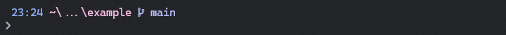

<h1 align="center"><strong>Oh My Posh Themes</strong></h1>

Repository with themes to use with the [Oh My Posh prompt engine](). Some themes are original, others adapted from [existing themes]().

#### Recommended fonts

- [Caskaydia Cove Nerd](https://www.nerdfonts.com/font-downloads)

<!-- Recommended example image dimensions: 720x50 -->

## Themes

### [midnight-cat](./themes/midnight-cat.omp.json)

	

